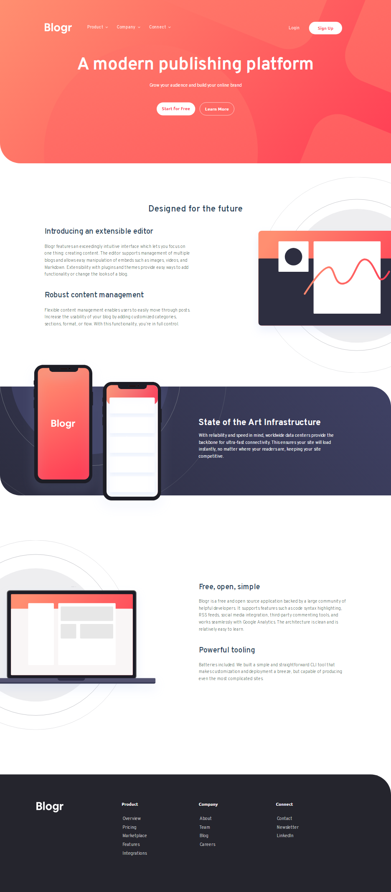

# Blogr landing page

This is a solution to the [Blogr landing page challenge on Frontend Mentor](https://www.frontendmentor.io/challenges/blogr-landing-page-EX2RLAApP). Frontend Mentor challenges help you improve your coding skills by building realistic projects.

## Table of contents

- [Overview](#overview)
  - [The challenge](#the-challenge)
  - [Screenshot](#screenshot)
  - [Links](#links)
- [My process](#my-process)
  - [Built with](#built-with)
  - [What I learned](#what-i-learned)

## Overview

### The challenge

Users should be able to:

- View the optimal layout for the site depending on their device's screen size
- See hover states for all interactive elements on the page

### Screenshot

_mobile view ( 375px )_\
\
_desktop view ( 1440px )_ \

### Links

- Solution URL: [Github Repo](https://github.com/bague-rodnel/blogr-landing-page)
- Live Site URL: [Github Pages](https://bague-rodnel.github.io/blogr-landing-page/)

## My process

### Built with

- Semantic HTML5 markup
- CSS custom properties
- Bootstrap 5
- Mobile-first workflow

### What I learned

Bootstrap defaults can be overriden through cascaded css declarations. It's only when there is a need to streamline/map Bootstrap keywords (i.e. -primary -secondary ...) to custom colors that a compiling a custom version of Bootstrap sass should be considered.
